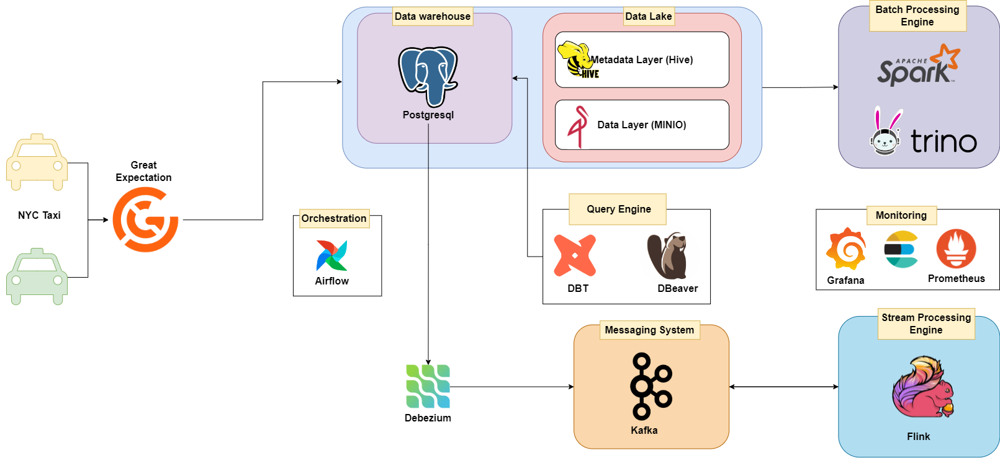

# MLE2
## **Description**: 

+In this repository, there is a constructed data pipeline featuring distinct flows tailored for batch and streaming data processing. Different services are utilized to meet the specific needs of each flow. Pyspark, PostgreSQL, Flink, Kafka, DBT, and Airflow are prominent among the services employed for these purposes. Moreover, monitoring tools like Prometheus, Grafana, and LogStash are integrated to ensure effective performance tracking.

## Overall data architecture




## Note:
+ **stream_processing** folder: contain pyflink scripts to process streaming data
+ **jars** folder: contain used jars file for data pipeline 
+ **airflow** folder: enviroment to run airflow service
+ **utils** folder: helper funtions
+ **This repo is implemented on nyc taxi data**

## 1. Installation
+ Tested on Python 3.9.12 (recommended to use a virtual environment such as Conda)
 ```bash
    conda create -n mle python=3.9
    pip install -r requirements.txt
 ```

+ Data: You can dowload and use this dataset in here: https://www.nyc.gov/site/tlc/about/tlc-trip-record-data.page. The format data i use in this Project is Parquet file

+ Docker engine
## How to guide 

You can use list command in `Makefile` to run service

For example: Run all service by command

 ```bash
    make run_all
 ```

 ### Airflow


 You can see task in `airflow/dags` in  `data1.py` and `data2.py`

 ```bash
    make airflow_up
 ```

 Accesss at http://localhost:8080/ to for Airflow UI to run dag
 
 You create connection `postgre_default` 
 

 data1: Download data ->Create streamming data -> Transform data

 data2: Create Datawarehous->Insert data-> Check expectations

### 2.1. MinIO
+ MinIO is a datalake service
+ We can access MinIO console at port 9001

#### 2.1.1. Manual interaction
+ First, click to **Buckets**

+ Choose **Create Bucket**

+ Name the bucket and click to **Object Browser**

+ Choose bucket had created on the console

+ Click **Upload** to upload any files or folders

#### 2.1.2. Automate interaction
+ Beside manual upload, we can use code to upload files or folder to MinIO
#### How to guide
+ ```cd utils```
+ ```python export_data_to_datalake.py```
+ All files needed to upload to MinIO will be executed 
