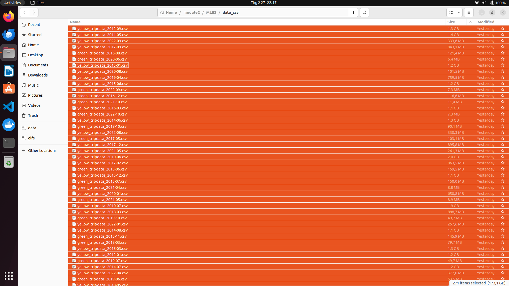

# MLE2
## **Description**: 

+ In this repository, there is a constructed data pipeline featuring distinct flows tailored for batch and streaming data processing. Different services are utilized to meet the specific needs of each flow. Pyspark, PostgreSQL, Flink, Kafka, DBT, and Airflow are prominent among the services employed for these purposes. Moreover, monitoring tools like Prometheus, Grafana, and LogStash are integrated to ensure effective performance tracking.

## Overall data architecture


## Note:
+ **stream_processing** folder: contain pyflink scripts to process streaming data
+ **jars** folder: contain used jars file for data pipeline 
+ **airflow** folder: enviroment to run airflow service
+ **utils** folder: helper funtions
+ **This repo is implemented on 170GB nyc taxi data**

## 1. Installation
+ Tested on Python 3.9.12 (recommended to use a virtual environment such as Conda)
 ```bash
    conda create -n mle python=3.9
    pip install -r requirements.txt
 ```

+ Data: You can dowload and use this dataset in here: https://www.nyc.gov/site/tlc/about/tlc-trip-record-data.page. The format data i use in this Project is Parquet file

+ Docker engine
## How to guide 

You can use list command in `Makefile` to run service

For example: Run all service by command

 ```bash
    make run_all
 ```
 ### Moniotring 
 Access at http://localhost:3000/ to for Grafana for tracking resource usage 
  
  
 ### Airflow


 You can see task in `airflow/dags` in  `data1.py` and `data2.py`

 ```bash
    make airflow_up
 ```

 Accesss at http://localhost:8080/ to for Airflow UI to run dag
 
 You create connection `postgre_default` 
 

 data1: Download data ->Create streamming data -> Transform data

 data2: Create Datawarehous->Insert data-> Check expectations

### Batch processing

+Pyspark helps efficiently handle big data, speeding up data reading and writing, and processing much faster as data grows.

+In this problem, we leverage Pyspark to transform and store data into a data warehouse, as well as quickly validate data.
#### How to guide

+ ```python pyspark/batch_processing.py``` 
+ ```python pyspark/spark_insert.py```
+ ```python pyspark/validation.py```

### Streaming data source
+ Nyc taxi streaming data is generated based on data from datalake
+ Each newly created data sample is stored in a table in PostgreSQL
+ Debezium then acts as a connector with PostgreSQL and will scan the table to check if the database has newly updated data.
+ Newly created data will be pushed to corresponding topics in kafka
+ Any consumer can receive messages from the topic to which the consumer subscribes
#### How to guide
First, we change directory to `stream_processing/kafka``
+ ```bash run.sh register_connector configs/postgresql-cdc.json```to send PostgreSQL config to Debezium

+ ```python create_table.py``` to create a new table on PostgreSQL
+ ```python insert_table.py``` to insert data to the table
+ We can access Kafka at port 9021 to check the results

+ Then click **Topics** bar to get all existing topics on Kafka

    + **nyc_taxi.public.nyc_taxi** is my created topic
+ Choose **Messages** to observe streaming messages

+ Finally, you can create kafka service for streaming data
``` 
cd stream_processing/kafka
docker build -t nyc_producer:latest .
docker image tag nyc_producer:latest ${name}/nyc_producer:latest
docker push ${name}/nyc_producer:latest #name is your docker hub name
```
### Streaming processing
+ To handle this streaming datasource, Pyflink is a good option to do this task
#### How to guide
+ ```cd stream_processing/scripts```
+ ```python datastream_api.py && python window_datastream_api.py```
    + These scripts will extract the necessary information fields in the message and aggregate the data to serve many purposes
    + Processed data samples will be stored in kafka in the specified sink

        + **nyc_taxi.sink.datastream** and **nyc_taxi.sink_window.datastream** is the defined sink and window sink in my case
+ ```python kafka_consumer.py```
    + Messages from the sink and window sink will be stored and used for analysis in the future

 
## Deploy data pipeline on Google Compute Engine
### Spin up your instance
Create your [service account](https://console.cloud.google.com/), and select [Compute Admin](https://cloud.google.com/compute/docs/access/iam#compute.admin) role (Full control of all Compute Engine resources) for your service account.

Create new key as json type for your service account. Download this json file and save it in `infra/ansible/secrets` directory. Update your `project` and `service_account_file` in `infra/ansible/create_compute_instance.yaml`.


Go back to your terminal, please execute the following commands to create the Compute Engine instance:
```bash
cd infra/ansible
ansible-playbook create_compute_instance.yaml
```


Go to Settings, select [Metadata](https://console.cloud.google.com/compute/metadata) and add your SSH key.

Update the IP address of the newly created instance and the SSH key for connecting to the Compute Engine in the inventory file.


+ ```cd ansible```
+ To initialize a compute engine, json key file of service account on google cloud is located at **secrets folder**
+ ```ansible-playbook create_compute_instance.yaml``` to create virtual machine instance using ansible. Configuration of machine was defined in file create_compute_instance.yaml

    + Virtual machine is ready to run
    + Before moving to next step, subtitute **External IP** of created compute engine to **inventory file** in **ansible folder**
 
+ ```ansible-playbook -i ../inventory deploy.yml``` to deploy data pipeline on cloud.